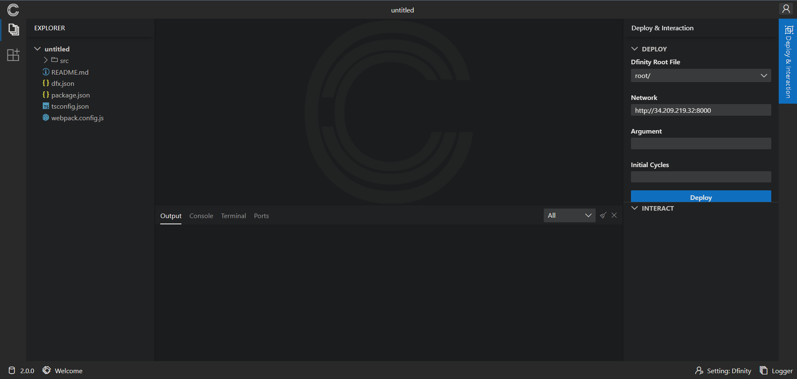
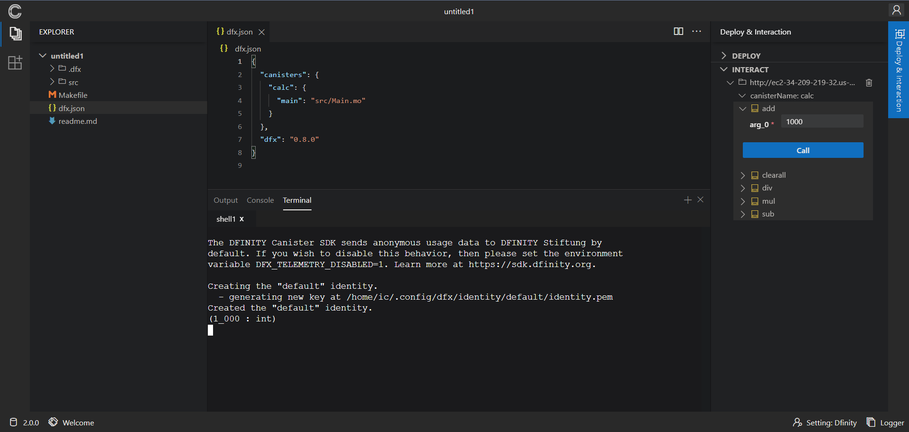

# 🚀 Welcome to Dfinity IDE Project

ChainIDE uses a form of plug-in to support Dfinity's project engineering.

Users can use the Dfinity development function corresponding to ChainIDE by enabling this plug-in in ChainIDE.
## Plugin Feature Description
* In ChainIDE, we use [Monaco Editor](https://microsoft.github.io/monaco-editor/index.html) as a document editor, and set up an editor environment for the Motoko programming language.
* ChainIDE currently provides an empty template and two sample templates, `Calc` and `Quicksort` what sources form [official example](https://github.com/dfinity/examples).
* We set up a [ChainIDE-Test Network](http://34.209.219.32:8000) for all users to connect to what ip is http://34.209.219.32:8000
* In our sandbox, we have pre-install the [DFINITY Canister
   SDK](https://sdk.dfinity.org)(dfx version 0.8.0) and [Node.js](https://nodejs.org/en/), and we provide two panels for dfinity development in this plugin:  `Deploy`  `Interact`

### Plugin System Structure
`src` is the main project directory.
`src/components` is the main function code, about `Deploy` `Interact` panels.
`src/extension.ts` is the project entry, exposes the following three attributes:

- `activate`: This function is triggered when the plugin is activated, with the function entry,
 -  - `ctx`: Plugin Internal Context
 -  - `chainIDEProxyImpl`: Plugin Interface

- `deactivate`: This function is triggered when the plugin is logged out
- `config`: Provides basic configuration information for the plugin，view `PluginConfigurations` type

### Deploy Panel

Users can quickly deploy their projects on `ChainIDE-Test Network` in this panel as follows:

We use DFINITY Canister SDK package in our sandbox to build project. After user clicks `Deploy` button, ChainIDE will open center-bottom Terminal Panel, and call `dfx deploy` service. Then it will display the command line output information.

<i>Deploy Panel Argument:</i>
 - `Dfinity Root File`：The project root directory, where the dfx.json configuration file is located

 - `Network`：Network address for project deployment

 - `Argument`： Specifies an argument using Candid syntax to pass to the canister during deployment. Note that this option requires you to define an actor class in the Motoko program.

 - `Initial Cycles`： Enables you to specify the initial number of cycles for a canister in a project.

### Interact Panel
ChainIDE currently identifies the deployed application by reading the file generated after the project has been deployed and renders the corresponding interaction; click to expand Interact Panel, select the function and enter the parameters, click `Call` button to bring up Terminal Panel, then you can see the result of the call in Terminal.

